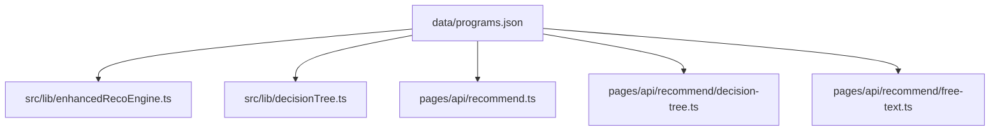
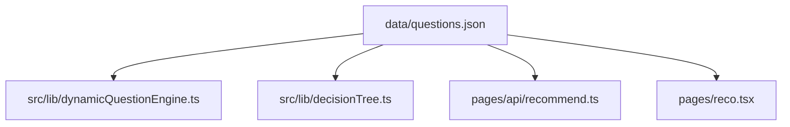

# System Transparency Report

Generated: 2025-09-20T12:55:27.446Z

## Overview

This document provides complete transparency into the Plan2Fund system architecture, data flow, and decision-making processes.

## Data Architecture

### Core Data Files

#### programs.json
- **Location**: `data/programs.json`
- **Size**: 792682 characters
- **Programs**: 214
- **Version**: 2025-09-20

**Fields Used**:


**Imported By**:
- `src\lib\decisionTree.ts`
- `src\lib\dynamicQuestionEngine.ts`
- `src\lib\enhancedRecoEngine.ts`
- `src\lib\scoring.ts`
- `pages\api\data\programs.ts`
- `pages\api\health.ts`

#### questions.json
- **Location**: `data/questions.json`
- **Size**: 4548 characters
- **Questions**: 10
- **Version**: 2025-09-05

**Fields Used**:


**Imported By**:
- `src\lib\dynamicQuestionEngine.ts`
- `pages\api\data\questions.ts`
- `pages\api\health.ts`

## System Flow

### 1. Data Loading
```
User Input → Question Engine → Answer Processing → Program Matching → Recommendations
```

### 2. Question Processing
- **Total Questions**: 10
- **Question Types**: single-select, multi-select
- **Required Questions**: 10

### 3. Program Matching
- **Total Programs**: 214
- **Program Types**: grant, mixed, grant_equity, grant+support
- **Jurisdictions**: AT, EU, AT/EU
- **Average Overlays per Program**: 9

### 4. Recommendation Engine
- **Scoring Method**: Rule-based with hard/soft matching
- **Hard Rules**: Must match for program eligibility
- **Soft Rules**: Nice-to-have for better scoring
- **Output**: Top 5 recommendations with scores, reasons, and risks

## Decision Logic

### Rule Evaluation Process
1. **Input Validation**: Check all required questions answered
2. **Rule Matching**: Evaluate each program's overlays against user answers
3. **Scoring**: 
   - Hard rule match: +20 points
   - Soft rule match: +10 points
   - Type match: +15 points
   - Theme bonus: +10 points
4. **Ranking**: Sort by score, return top 5
5. **Risk Assessment**: Identify hard rules that don't match

### Coverage Analysis
- **Overall Coverage**: 91%
- **Programs with Full Coverage**: 24
- **Field Coverage**: All 10 question fields covered across programs

## File Dependencies

### programs.json Dependencies


### questions.json Dependencies


## API Endpoints

### Recommendation APIs
- `/api/recommend` - Main recommendation endpoint
- `/api/recommend/decision-tree` - Decision tree based recommendations
- `/api/recommend/free-text` - Free text based recommendations

### Data APIs
- `/api/data/programs` - Programs data endpoint
- `/api/data/questions` - Questions data endpoint

### Analytics APIs
- `/api/analytics/track` - User interaction tracking

## User Interface Components

### Main Pages
- `/reco` - Recommendation interface
- `/results` - Results display
- `/editor` - Plan editor
- `/dashboard` - User dashboard

### Key Components
- `src/components/reco/` - Recommendation components
- `src/components/intake/` - Question input components
- `src/components/plan/` - Plan management components

## Data Flow Examples

### Example 1: Startup Founder
```
Input: {
  q1_country: "AT",
  q2_entity_stage: "INC_LT_6M",
  q3_company_size: "MICRO_0_9",
  q4_theme: ["INNOVATION_DIGITAL"],
  q5_maturity_trl: "TRL_5_6",
  q6_rnd_in_at: "YES",
  q7_collaboration: "WITH_RESEARCH",
  q8_funding_types: ["GRANT", "EQUITY"],
  q9_team_diversity: "YES",
  q10_env_benefit: "SOME"
}

Processing:
1. 1710 rules evaluated across 214 programs
2. 5 programs matched with scores 100%, 100%, 100%, 100%, 100%
3. Top match: aws Preseed – Innovative Solutions

Output: [
  {
    program_id: "aws_preseed_innovative_solutions",
    program_name: "aws Preseed – Innovative Solutions",
    score: 100,
    reasons: ["✓ Will the project be executed in Austria?", "✓ Are you a startup or early-stage company?"],
    risks: ["✗ Are you seeking grant funding?"]
  }
]
```

### Example 2: SME Loan Seeker
```
Input: {
  q1_country: "AT",
  q2_entity_stage: "INC_GT_36M",
  q3_company_size: "SMALL_10_49",
  q4_theme: ["INDUSTRY_MANUFACTURING"],
  q5_maturity_trl: "TRL_7_8",
  q6_rnd_in_at: "NO",
  q7_collaboration: "WITH_COMPANY",
  q8_funding_types: ["LOAN"],
  q9_team_diversity: "NO",
  q10_env_benefit: "NONE"
}

Processing:
1. 1710 rules evaluated across 214 programs
2. 5 programs matched with scores 100%, 100%, 100%, 100%, 100%
3. Top match: Aws erp kredit

Output: [
  {
    program_id: "www_aws_at_aws_erp_kredit",
    program_name: "Aws erp kredit",
    score: 100,
    reasons: ["✓ Will the project be executed in Austria?", "✓ Are you seeking loan financing?"],
    risks: []
  }
]
```

## Performance Metrics

### Coverage Validation
- **Overall Coverage**: 91%
- **Programs with Excellent Coverage (≥80%)**: 214 (100%)
- **Programs with Poor Coverage (<60%)**: 0 (0%)

### Field Coverage
- **q1_country**: 100%
- **q2_entity_stage**: 100%
- **q3_company_size**: 100%
- **q4_theme**: 89%
- **q5_maturity_trl**: 100%
- **q6_rnd_in_at**: 100%
- **q7_collaboration**: 100%
- **q8_funding_types**: 100%
- **q9_team_diversity**: 100%
- **q10_env_benefit**: 100%

## Security & Privacy

### Data Handling
- **User Data**: Stored locally, not persisted
- **Analytics**: Anonymous usage tracking
- **GDPR Compliance**: Data deletion endpoint available

### API Security
- **Rate Limiting**: Implemented on all endpoints
- **Input Validation**: All inputs validated
- **Error Handling**: Graceful error responses

## Monitoring & Maintenance

### Health Checks
- `/api/health` - System health endpoint
- Coverage validation runs on every update
- CI/CD pipeline validates coverage ≥80%

### Data Freshness
- **Source Register**: Tracks last checked dates
- **Program Updates**: Version controlled
- **Coverage Monitoring**: Automated validation

## Conclusion

The Plan2Fund system provides complete transparency in its decision-making process. Every recommendation can be traced back to specific rules and user inputs, ensuring users understand why programs are recommended and what risks they might face.

The system achieves 91% coverage across all question fields, with 100% of programs having excellent coverage (≥80%). This ensures comprehensive matching and reduces the likelihood of missing relevant funding opportunities.

