Businessplan

**Praxisfall:** **Businessplan** **runtastic** **–** **makes** **sport**
**funtastic!**

Nach einer Übersicht über die für die Gründungsplanung wichtigen
betriebswirtschaftlich-rechtlichen Fragestellungen und dem darauf
aufbauenden Kap. 12, welches eine Hilfestellung bei der Erarbeitung des
eigenen Businessplanes bietet, wird im Folgenden ein realer Businessplan
eines inzwischen sehr erfolgreichen Linzer IT-Unternehmens
„ungeschminkt“ wiedergegeben.

Wir bedanken uns bei **Florian** **Gschwandtner**, **René**
**Giretzlehner**, **Christian** **Kaar** und **Alfred** **Luger**, dem
Gründer-Team von „runtastic, die uns freundlicherweise ihren
Originalbusinessplan (Version August 2009) zur Veröffentlichung zur
Verfügung stellten. Dieser ist lediglich an einigen Stellen leicht
verändert und um Anhangsteile gekürzt worden. Aus Kostengründen mussten
wir bei der SW-Reproduktion auf Farbeffekte und Fotos des Originals
verzichten.

Warum wurde gerade dieser Businessplan ausgewählt? Er wurde im
Businessplanwettbewerb i2b ausgezeichnet und bildet durch die
hochschulübergreifende, interdisziplinäre Zusammensetzung des Teams auch
eine wichtige Zielgruppe unseres Buches ab. Zudem zeigt gerade dieser
Fall deutlich auf, wie Alumni gezielt die Ressourcen ihrer
Stammhochschulen auch nach dem Studium für die Entwicklung ihres
Businessplan sowohl in der Phase der Gründungsplanung als auch als
Jungunternehmer nutzen können – sei es durch Einbeziehung technischer
Expertise der FHs, sei es durch gezielte Vergabe von Projektarbeiten (zB
in Lehrveranstaltungen an der Uni) oder durch Diplomarbeiten.

> 1

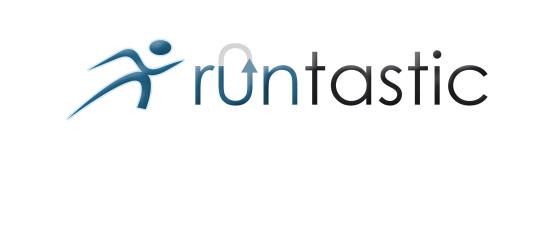

**Businessplan**

> Aufbau des Sportportals www.runtastic.at inkl. Bereitstellung von
> fixen und mobilen Technologien zur Erfassung und Verwaltung der
> Sportdaten, sowie zur Vernetzung der Sportler, um Spaß am Sport zu
> vermitteln und Personen zur Sportausübung zu bewegen.
>
> **Gründer-Team:**
>
> Florian Gschwandtner, MSc. René Giretzlehner, MSc. Christian Kaar,
> MSc.
>
> Mag. Alfred Luger, MA
>
> 2

Businessplan

**1.** **Executive** **Summary**

Das Start-Up Unternehmen runtastic GmbH das im Oktober 2009 gegründet
wird, betreibt ein Webportal, wo lauf- und sportinteressierte Personen
ihre individuellen Leistungsdaten vorfinden und mit Gleichgesinnten
vernetzt werden.

**Produkte** **und** **Dienstleistungen:**

Für **Millionen** **von** **Sportlern** **(Läufer,** **Walker,**
**Radfahrer)** **in** **Österreich**, aber auch international, wird es
möglich, ihre eigenen Sportdaten im Webportal
[**www.runtastic.at**](http://www.runtastic.at/) zu verwalten, sich
Statistiken und Auswertungen dazu anzusehen und diese mit Freunden und
Gleichgesinnten zu teilen. Mit Wettbewerben und einem innovativen
Gutscheinkonzept sowie dem sogenannten „Drill Sergeant“ gelingt es uns,
Personen zur gemeinsamen Sportausübung zu motivieren. Zudem wird die
Kommunikation während und nach der Sportausübung gefördert. Die Faktoren
**Spaß** **am** **Sport** **und** **Unterhaltung** stehen im Vordergrund
des Unternehmenskonzepts. Das Portal wird aufgrund einer zukünftigen
internationalen Expansion und dem weltweiten Vertrieb von mobilen
Applikationen über die Verkaufsstores der Hersteller (zB iPhone
Laufapplikation im Apple Store) von Beginn an zweisprachig
(Deutsch/Englisch) betrieben.

Die **sportbezogenen** **Daten** werden aus **fix** **installierten,**
**selbst** **entwickelten** **Zeitmessstationen**, sowie aus eigenen
**mobilen** **Applikationen** (Mobiltelefone, Pulsuhren, …) gewonnen.
Danach werden diese Daten OHNE Aufwand für den Sportler, drahtlos auf
das Webportal übertragen und dort für den Sportler optisch ansprechend
aufbereitet. Ergänzend dazu werden den Klienten
Sportstreckenbeschilderungen (vor allem in kleineren oder finanziell
schwächeren Gemeinden/Städten) auch ohne die Zeitmessstationen
angeboten.

**Marketing:**

Als Zielgruppen gelten im ersten Schritt **Läufer** **und** **Walker**
und danach auch Radfahrer, Mountainbiker, Skater und Wanderer. In
weiterer Zukunft (in ca. 5 Jahren) könnten noch weitere Sportarten durch
Adaption der entwickelten Technologien (zB Motocross, …), bedient
werden.

Für Firmen- und Marketingpartner sowie für Städte und Gemeinden gibt es
die Möglichkeit, eigene Sportstrecken zu betreiben und von den vielen
**Marketing-** **und** **Kooperationsmöglichkeiten** zu profitieren.
Weiters können **Affiliatepartner** ihre Produkte in unserem Webshop
gegen Provision vertreiben.

> 3

Businessplan

**Das** **Unternehmen**

Die **runtastic** **GmbH** wird von **vier** **Akademikern**, welche
bereits über mehrjährige Projekterfahrung verfügen, gegründet. Neben den
sich ergänzenden Kompetenzen aus unterschiedlichen Studienrichtungen
zeichnet sich das Projektteam vor allem durch seine kooperative, von
Offenheit geprägte Arbeitsweise aus, die durch die umfangreiche Nutzung
neuer Internettechnologien als sehr fortschrittlich betrachtet werden
darf.

Jeder der **vier** **Gründer** hält einen Anteil von **25%** an der
**runtastic** **GmbH**, wobei zwei Personen als Geschäftsführer
(kaufmännisch/technisch) fungieren werden. Die Rechtsform der GmbH wurde
aus haftungs- und steuerrechtlichen Gründen gewählt.

**Kooperationen:**

Es werden Kooperationen mit der **FH** **Hagenberg**, **FH** **Steyr**
**und** **der** **FH** **Wels** (technische Entwicklung), mit den
**Betreibern** **der** **Sportstrecken** (Marketing- und
Vertriebskooperation), sowie mit **Akteuren** **im**
**Gesundheitssektor**, wie Ärzte oder Therapeuten (Bereich F&E)
eingegangen, um nachhaltig am Markt Fuß fassen zu können.

**Status** **der** **technischen** **Entwicklung:**

Der **Markteintritt** (Beta) erfolgt Mitte **Oktober** **2009**. Die
bereits seit 12 Monaten laufende und vom Förderprogramm des tech2b
Business Inkubators ermöglichte technische Entwicklung hat bisher
(Status Ende August 2009) zu folgenden Ergebnissen geführt: Die **fix**
**installierten** **Zeitmessstationen** **für** **Sportstrecken**
(Prototyp mit Stromanbindung vor Ort) wurden **bereits** **erfolgreich**
**im** **Feld** entlang einer privat aufgebauten Sportstrecke
**getestet**. Das **Webportal** (Grundfunktionalität) befindet sich in
der **fortgeschrittenen** **Testphase** für den für Mitte Oktober 2009
geplanten Beta Launch der Portals. Gleichzeitig mit dem Sportportal wird
die erste, bereits entwickelte **mobile** **Applikation** (runtastic
iPhone Laufapplikation) international eingeführt. Derzeit finden
**Live-Tests** im Feld statt.

**Finanzierung:**

Bis Ende 2014 wird ein Umsatz (kumuliert) von über **11** **Mio.** **€**
mit knapp über **300.000** **Nutzern** des Webportals
[**www.runtastic.at**](http://www.runtastic.at/) erwartet. 170.000 davon
sollen mit unserem fixen Sportsystem gewonnen werden. Dies entspricht in
Österreich einem **Marktanteil** **(im** **Jahr** **2014)** **von**
**6,7%.** Etwa 140.000 User werden mit unseren mobilen Applikationen,
allen voran durch unsere iPhone-Applikation (ca 65.000 User), gewonnen.
Dies entspricht einem internationalen Marktanteil (2014) von ca. 0,5% an
den verkauften iPhones. Die restlichen User teilen sich auf mobile
Applikationen anderer Hersteller (zB Google, Nokia) sowie die an das
Portal angebundenen Pulsuhren (zB Polar, Garmin, Suunto) auf.

Der **Finanzierungsbedarf** für die runtastic Geschäftsidee liegt bei
**350.000** **€** im Basisszenario. Die Finanzmittel werden vor allem
für Personal, als auch die Aufrechterhaltung des täglichen Betriebs
(Räumlichkeiten, Marketing, Produktion, Vertrieb) benötigt. Dieser
Bedarf soll sowohl aus

> 4

Businessplan

Eigenmitteln als auch aus Förderungen (Zuschüsse, zinsgünstige Darlehen)
sowie durch eine Kooperation mit einem strategischen Investor („Business
Angel“) gedeckt werden.

Der Break-Even-Point wird im Basis-Szenario im dritten Geschäftsjahr
(2012) erreicht.

**Potential:**

Die runtastic Geschäftsidee beinhaltet die Chance einen internationalen
Markt zu erobern und die Services für weitere Zielgruppen und ähnlich
gelagerte Bereiche zu erweitern. Die **niedrigen** **Marktanteile**, die
dem bereits **profitablen** **Geschäftsmodell** zugrunde liegen, zeigen
das hohe zukünftige Potential. Zudem wird erwartet, dass der Sport- und
Gesundheitssektor in den nächsten Jahren weiter wachsen wird, was den
Bemühungen von runtastic sehr entgegen kommt.

> 5

Businessplan

**2.** **Produktidee**

> **2.1.** **Kundenbedürfnisse** **und** **Problemlösung**

**runtastic** **ermöglicht** **erstmals** **in** **Österreich** **eine**
**komfortable** **Verwaltung,** **ohne** **Aufwand** **des**
**Benutzers,** **der** **Sportdaten** **für** **Läufer,**
**Nordic-Walker** **und** **Radfahrer** **bei** **gleichzeitiger**
**Vernetzung** **dieser** **mit** **Gleichgesinnten** **im**
**Webportal** **www.runtastic.at!**

Die Verwaltung von Sportdaten musste bis jetzt immer sehr aufwendig
händisch oder mittels der beigelieferten Software durchgeführt werden.
Das Problem dabei ist, dass alle Hersteller ihre eigene Software
mitliefern und somit keine Kompatibilität zwischen den einzelnen Geräten
vorhanden ist. Die Verwaltung von Trainingsplänen für den Sportbereich
ist zwar auf einigen Plattformen möglich. Meist fehlt aber hier wieder
die Möglichkeit eines automatischen Trainingsdatenuploads und somit
müssen die Daten händisch nachgetragen werden. All diese Aspekte
zusammen betrachtet führen zu dem Problem, dass es bis dato für Sportler
aufgrund der mangelnden Usability nur unter schwierigen Voraussetzungen
möglich ist, ihre persönlichen Leistungsdaten zu verwalten.

Hinzu kommt noch, dass angelegte Daten oftmals durch den Wechsel der
eigenen Sportgeräte unbrauchbar werden oder durch den Wechsel des
eigenen Computers verloren gehen. Diese Probleme werden mit dem
runtastic Portal und dessen automatischer Datenverwaltung gelöst. Durch
die Onlineverwaltung der Daten hat jeder Benutzer die Möglichkeit immer
und von überall auf seine privaten Leistungsdaten zuzugreifen.

Das runtastic Webportal beinhaltet typische Social Community
Eigenschaften wie persönliches Kontaktnetzwerk, Nachrichtensystem und
die Möglichkeit für die Nutzer Inhalte selbst zu generieren
(Statusmeldungen, Blogs, Fotos, Neuigkeiten, Kommentare und Foren).
Zudem werden spezielle auf den Sport angepasste Features angeboten:
Persönliche Leistungsvergleiche zwischen Freunden, Wettkämpfe zwischen
Personen oder Gruppen unabhängig von deren Standort sowie Wettbewerbe
zwischen Firmen, Städten oder Regionen. Weiters kann der Sportler seine
Trainingdaten mit seinen Freunden teilen, um sich Tipps zu holen oder
mit Gleichgesinnten und Vorbildern (sportlich gesehen) auszutauschen.
Diese Möglichkeiten fördern den Spaß und die Motivation am Sport.

Neben dem Aufbau des Portals ist das Ziel von runtastic, eine möglichst
hohe Kompatibilität zu bereits am Markt etablierten Sportgeräten zu
bieten. Zusätzlich wurden eigene Messstationen entwickelt und
programmiert, um auf stark frequentierten Lauf-/Radfahrstrecken in
Städten und Gemeinden berührungslose Zeitmessung vornehmen zu können.

> 6

Businessplan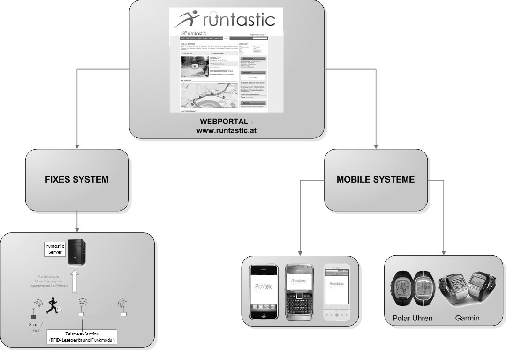

Neben diesen fixen Messstationen bietet runtastic den Sportlern mobile
Softwarelösungen zur Erfassung von Bewegungsdaten und des
Kalorienverbrauches bei gleichzeitigem Echtzeitfeedback an. Die
erfassten Daten werden unmittelbar auf das runtastic Webportal
übertragen und für die weitere Nutzung am Portal aufbereitet. Dies
ermöglicht dem Nutzer eine ortsunabhängige Sportausübung und erlaubt von
Beginn an eine internationale Nutzung des runtastic Portals.

Da es keine Plattform oder Community gibt, die als Social Network im
Internet auftritt und zusätzlich die Leistungsdaten von Sportlern
aufzeichnet und verwaltet, ergibt sich eine bedeutende Marktlücke, die
runtastic mit seinem Produkt- und Dienstleistungsportfolio schließt.

> **2.2.** **Produkte** **und** **Dienstleistungen**

**Runtastic** bietet Produkte und Dienstleistungen rund um die
**Erfassung** **von** **Sportdaten** (fixe und mobile Systeme),
**Verwaltung** **der** **Sportdaten** (Webportal) sowie das **Teilen**
**der** **Sportdaten** **mit** **Gleichgesinnten** (Community) an.

**Abbildung** **1:** **Schematische** **Darstellung** **der**
**Komponenten** **der** **Produktidee**

> 7

Businessplan

> **2.2.1.Sportportal** **www.runtastic.at**

Sportler bekommen in Zukunft all ihre Daten in aufbereiteter Form zur
Verfügung gestellt und können sich dabei gleichzeitig noch mit
Gleichgesinnten austauschen. Die Plattform enthält neben
Sportinformationen, Datenverwaltung, Social Community Features, auch ein
Forum zum Interessensaustausch sowie einen Webshop mit den wichtigsten
Sportartikeln bzw. Sportnahrungsartikel. Aufgrund einer zukünftigen
internationalen Expansion wird das Portal zweisprachig in Englisch und
in Deutsch betrieben.

Am Webportal unterscheiden wir zwischen Basis-Accounts und
Premium-Accounts. Erstere sind für alle Benutzer gratis und stehen
dauerhaft zur Verfügung. Will ein Benutzer jedoch aus dem kompletten
Leistungsangebot des runtastic Portals schöpfen, so benötigt er einen
Premium Account.

**Ausgewählte** **Möglichkeiten** **auf** **www.runtastic.at:**

> • Komplettangebot für die Verwaltung der Sportdaten inkl.
> umfangreicher Statistiken
>
> •  Wettbewerbe zwischen Personen oder zwischen Städten zur Förderung
> der sportlichen Aktivitäten der Benutzer
>
> • Gutscheinsystem, das mit den Wettbewerben gekoppelt wird • „Drill
> Sergeant“ der die Benutzer erinnert Sport zu betreiben
>
> • Einfacher Datenaustausch für Benutzer (Nutzerfreundliche
> Anwendungen) • Automatische Erstellung und Überwachung von
> Trainingsplänen
>
> • Austausch mit Gleichgesinnten und Teilen von Daten, Bildern,
> Statistiken, … • Plattform für „alles“ im Bereich Laufen und Sport
> Single-Point-of-Contact
>
> • Verbindung mit anderen neuen Medien und Portalen – Social Networks
> (zB Facebook, Twitter), Geotagging, RSS
>
> 8

Businessplan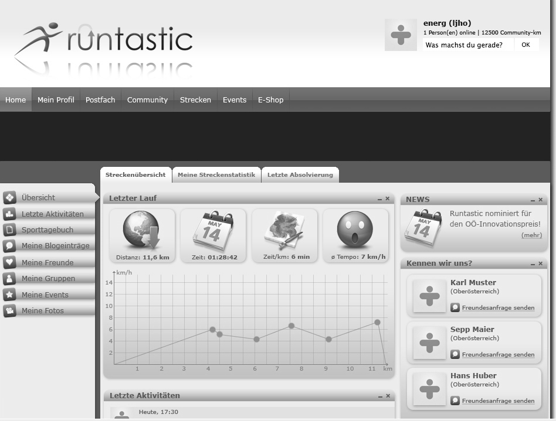

In Zukunft soll die Plattform um eine Dienstleistung im gesundheitlichen
Beratungsbereich erweitert werden. Das Thema „Übergewicht“ ist in den
letzten Jahren zu einem immer wichtigeren Bereich der Gesellschaft
geworden und wird somit auch von runtastic verstärkt behandelt werden.
Die auf der Plattform generierten, volkswirtschaftlich sehr relevanten
Daten zum Sport- und Gesundheitsverhalten dienen als Grundlage für diese
neuen Dienstleistungen.

Zudem werden Programmierschnittstellen (APIs) für Sportbegeisterte,
Ärzte oder Akteure des Gesundheitswesens geöffnet, um deren eigenen
Ideen zu realisieren. Dieser Schritt wird Ende 2010 erfolgen.

> **2.2.2.Fixes** **System**

Das fixe System basiert auf einer berührungslosen Zeitmessung
(RFID-Technologie) der Läufer durch in die Strecke integrierte
Messstationen. Durch einen am Schuh angebrachten RFID-Chip, erkennt

> 9

Businessplan

die Messstation den Läufer automatisch und sendet die Daten an das
Webportal. Aus der mehrfachen Erfassung der Sportler entlang der
ausgestatteten Strecke (mehrere Messstationen) werden Distanz, Zeit,
Geschwindigkeit, Höhenmeter und Route ermittelt, die als Basis für
weiterführende Statistiken dienen.

Das fixe System stellt ein Pendant zum gängigen Zeitmesssystem der Firma
Championchip dar, welches ausschließlich bei Sportwettkämpfen (zB
Marathon) zum Einsatz kommt. Es wurde vom Gründerteam selbst entwickelt
und kann aufgrund der guten Preisstruktur zur permanenten Ausstattung
von Laufstrecken in Städten und Gemeinden verwendet werden. Durch ein
Erlösbeteiligungsmodell wird die Investition für die Stadt/Gemeinde
nochmals vereinfacht, da sich die Strecke nach einer bestimmten Zeit
amortisiert.

Zur Nutzung des fest installierten Systems werden für Sportler
RFID-Chips zum Verkauf angeboten. Auch hier besteht die Möglichkeit, die
Chips zu „branden“, um somit das Sponsoring von Laufstrecken zu
erleichtern.

Die Laufstationen werden mit Solarenergie (gekoppelt mit einer Batterie)
betrieben, womit eine Unabhängigkeit von lokalen Stromquellen gegeben
ist. Dies ermöglicht die Ausstattung von ländlichen Laufstrecken (Wald,
Natur, …) und unterstreicht den Umweltgedanken. Alternativ dazu ist eine
fixe Stromanbindung ebenfalls möglich.

> **2.2.3.Laufstreckenbeschilderung**

Ergänzend zu den Zeitmessstationen bietet runtastic den Klienten die
Beschilderung der Sportstrecken an. Es werden die
Streckenbeschaffenheit, der Schwierigkeitsgrad, die Streckenlänge inkl.
grafischer Aufbereitung, Kilometermarken sowie die Sponsoren
dargestellt.

Die Laufstreckenbeschilderung wird auch separat als Dienstleistung für
Städte und Gemeinden angeboten, die sich die Zeitmessstationen nicht
leisten können bzw. wollen.

> **2.2.4.Mobile** **Systeme**

Mobile Endgeräte sind zum ständigen Begleiter vieler Personen geworden
und bieten aufgrund ihrer Funktionalität (MP3-Player, Digitalkamera,
GPS-Sensor) eine ideale Ergänzung für Freizeit- und Sportaktivitäten. Um
dieses Potential für das runtastic Webportal nutzbar zu machen, werden
eigene Sportapplikationen zur Datenerfassung und Trainingsunterstützung
entwickelt. Die aufgezeichneten Daten werden automatisch an das
Webportal übermittelt und stehen dem Sportler sowohl am mobilen Endgerät
als auch online zur Verfügung.

> 10

Businessplan

> 1\) **Mobiltelefone:** Für die meistverbreiteten GPS-fähigen
> Mobiltelefone (iPhone, Google Android, Nokia) werden eigene
> Sportapplikationen entwickelt und über die Online Vertriebskanäle (App
> Stores) der Hersteller weltweit vertrieben. Zusätzlich erweitern
> neuartige Bluetooth-Brustgurte, welche die Erfassung des zusätzlichen
> Parameters Puls ermöglichen, das Angebot an Auswertungsmöglichkeiten
> und Statistiken.
>
> 2\) **Pulsuhren:** Die von den Sportlern präferierten Pulsuhren
> (Polar, Garmin, Suunto) werden an das runtastic-Portal angebunden.
> Dazu entwickelt runtastic eine eigene benutzerfreundliche Software,
> welche die Daten automatisch auf das Webportal **www.runtastic.at**
> überträgt. Die Software wird kostenlos zum Download zur Verfügung
> gestellt.
>
> **2.3.** **Einzigartigkeit** **und** **Innovation**

**Runtastic** **ist** **aufgrund** **der** **Verknüpfung** **vieler**
**isolierter,** **teilweise** **bereits** **am** **Markt**
**bestehender,** **Ansätze** **im** **Bereich** **des** **Sports**
**zu** **einem** **homogenen** **Ganzen** **einzigartig.** **Runtastic**
**entwickelt** **ganzheitliche** **und** **zueinander** **kompatible**
**Lösungen** **im** **Bereich** **Erfassung,** **Verwaltung** **und**
**Teilen** **der** **Sportdaten** **mit** **Gleichgesinnten.**

Mit unseren fixen Messstationen können wir uns eindeutig von der
Konkurrenz abheben. Erstens gibt es in Österreich neben runtastic nur
Pentek1, die über diese Technologie verfügen. Zweitens setzt Pentek
diese Technologie, in einer etwas anderen Konfiguration, nur für große
Laufveranstaltungen ein und nicht wie runtastic mit fixen Sportstrecken,
die das ganze Jahr über verfügbar sind. Und drittens können wir einen
Kostenvorteil bei diesem System gegenüber Pentek realisieren. Dies macht
uns einzigartig.

Der innovative Charakter von runtastic liegt unter anderem auch darin,
Mobiltelefone neben der Grundfunktionalität auch als Sportgerät zu
verwenden. So muss sich der Benutzer nicht um die Verwaltung der Daten
kümmern und kann diese jederzeit online abrufen. Neben der Möglichkeit
eine sportliche Aktivität zu messen, wird die bisherige am Markt
verfügbare Software so erweitert, dass dem Benutzer die Möglichkeit
geboten wird, gegen andere Sportler am Portal oder auch gegen seinen
eigenen „Geist/Ghost“ anzutreten. Die Anbindung eines neuartigen
Bluetooth-Brustgurts erweitert das Angebot um eine wichtige Komponente
für alle, die den Sport professioneller ausüben. Des Weiteren ist eine
der wichtigsten Dienstleistungen die Verwaltung der Leistungsdaten von
Sportlern. Aus diesen Daten können für die Community relevanten
Informationen und Statistiken generiert werden, welche wiederum für die
Erstellung von Trainingsplänen und neuer Software verwendet werden
können. Zudem können **volkswirtschaftlich** **relevante** **Daten**
extrahiert werden (Sport in der Stadt vs. Land, alters- oder
geschlechterspezifisch usw.), welche für Politik, Wirtschaft und das
Gesundheitswesen neue Impulse geben können.

1 [<u>http://www.pentek-timing.at</u>](http://www.pentek-timing.at/)

> 11

Businessplan

**Die** **Kombination** **aus** **Sport,** **Lifestyle** **und**
**Entertainment** **gepaart** **mit** **ausgereiften** **fixen** **und**
**mobilen** **Technologien** **macht** **runtastic** **einzigartig.**

> **2.4.** **Schutzstrategie**

Durch die lange Vorlaufzeit in der Entwicklung der Messstationen, im
Aufbau des Portals und auch in der Entwicklung von mobilen Anwendungen
ist ein First-Mover-Advantage zu erwarten, der uns zumindest kurzfristig
vor Nachahmern schützt.

Bei den fix installierten Systemen ist eine nachhaltige strategische
Festigung am Markt gegeben, da Gemeinden mit großer Wahrscheinlichkeit
Investitionen in eine eigene Messstrecke nicht zweimal tätigen werden.
Ziel ist es, in den großen Städten und Gemeinden unsere fixen
Messstationen zu installieren, da wir damit nachhaltig Sportler für
unser Webportal gewinnen, die wir in weiterer Folge mit unseren mobilen
Lösungen weiter an runtastic binden.

Zusätzlich wurde auch ein Patent *(„Wissensdatenbanksystem* *zur*
*Verarbeitung* *von* *bei* *Ausübung* *eines* *Sportes* *relevanten*
*Daten,* *umfassend* *eine* *Datenempfangseinheit,* *eine*
*Datenverarbeitungseinheit,* *eine* *Ausgabeeinheit* *und* *eine*
*Speichereinheit.“*) eingereicht, welches die Verwaltung von Sportdaten
in einer Wissensdatenbank festhält. Es trägt das Aktenzeichen A577/2009
und wurde am 15. April 2009 eingereicht. Dieses Patent ist aktuell im
Validierungsstatus.

> 12

Businessplan

**3.** **Unternehmerteam**

> **3.1.** **Gründer**

Das Team vereint die kaufmännischen und technischen Kompetenzen sowie
Erfahrungen der vier Gründer zu einem schlagkräftigen Unternehmerteam
mit einer bereits gelebten Vision.

**René** **Giretzlehner,** **MSc.** **–** **Geschäftsführer**

René hat den Masterstudiengang Mobile Computing an der FH
Oberösterreich, Campus Hagenberg im Juli 2008 mit ausgezeichnetem Erfolg
abgeschlossen. Zuvor besuchte er den gleichnamigen
Bakkalaureatsstudiengang an der FH Oberösterreich sowie die HTBLA für
EDV und Organisation in Leonding, die er jeweils mit ausgezeichnetem
Erfolg abschloss.

In den fünf Jahren während des Studiums war René durchgängig als freier
Mitarbeiter für das Unternehmen LBS-logics in Linz im Bereich Forschung
und Entwicklung tätig und konnte umfangreiche Erfahrung in der
Abwicklung von Kundenprojekten und im Bereich der Mobile-, Web-und
Server-Software-Entwicklung im Zusammenhang mit GPS-basierten
Anwendungen sammeln. Durch ein an der FH durchgeführtes Projekt im Zuge
der World Sailing Games 2006 ist bei René die Idee und der Wunsch
entstanden, mobile softwaregestützte Sportanwendungen in einem
Unternehmen bis zur Marktreife zu entwickeln und zu vertreiben. Daraus
wurde in weiterer Folge im September 2007 gemeinsam mit Christian Kaar
und Stephan Selinger das tech2b-Startup „mSports“ gegründet, welches im
Februar 2009 in runtastic überführt wurde.

René möchte etwas Eigenständiges schaffen, sich den Herausforderungen
als Entrepreneur stellen sowie eigene Ideen verwirklichen und damit
sicherstellen, dass sich andere Personen für mehr Sport-und
Gesundheitsbewusstsein begeistern können.

**Florian** **Gschwandtner,** **MSc.** **–** **Geschäftsführer**

Florian hat den Masterstudiengang Mobile Computing an der FH
Oberösterreich, Campus Hagenberg im Juni 2008 mit Erfolg abgeschlossen.
Zuvor besuchte er den gleichnamigen Bakkalaureatsstudiengang an der FH
Oberösterreich.

Während seiner schulischen Ausbildung nützte Florian immer die
Gelegenheit, in den Ferien Erfahrungen in Form von Praktika zu sammeln
(Kapsch, Siemens Ukraine, …). Durch die Vielfalt an Berufserfahrungen
wurde Florian schnell klar, dass alleine das Technik Know-How oftmals
nicht ausreicht, wenn es um den Erfolg in einem Unternehmen geht.
Daraufhin beschloss Florian, parallel zum Mobile-Computing-Studium ein
zweites Masterstudium an der Fachhochschule Steyr zu beginnen. Die
Studienrichtung „Supply-Chain-Management“ eignete sich perfekt, um
Defizite im

> 13

Businessplan

wirtschaftlichen Bereich zu kompensieren. Nach seinem Studienabschluss
in Hagenberg engagierte sich Florian bis Juni 2009 als Projektmanager
eines Softwareunternehmens.

Der Wunsch, ein eigenes Unternehmen zu gründen, war schon immer in
Florians Gedanken verankert. Doch ihm war auch klar, dass dafür die
Umgebung, die Kollegen und die passende Idee vorhanden sein muss. Dies
ist bei runtastic der Fall.

**Christian** **Kaar,** **MSc.** **–** **Leitung** **der**
**technischen** **Entwicklung**

Christian hat den Masterstudiengang Mobile Computing an der FH
Oberösterreich, Campus Hagenberg im September 2008 mit ausgezeichnetem
Erfolg abgeschlossen. Zuvor besuchte er den gleichnamigen
Bakkalaureatsstudiengang an der FH Oberösterreich sowie die HTBLA für
EDV und Organisation in Leonding, die er jeweils mit ausgezeichnetem
Erfolg abschloss.

Während seiner Schul- und Studienlaufbahn absolvierte er im Bereich der
Softwareentwicklung zahlreiche Praktika und freiberufliche Tätigkeiten
und konnte in diesem Zusammenhang bei diversen namhaften, zum Teil
international tätigen Konzernen Berufserfahrung sammeln. Im Rahmen
seiner Tätigkeit bei Siemens München lernte er überdies die Arbeit in
einem multikulturellen Umfeld kennen und konnte wertvolle
Auslandserfahrung sammeln. Obwohl die Praktika meist nur wenige Monate
dauerten, bekam Christian schon bald verantwortungsvolle Aufgaben
übertragen und war sowohl in die Implementierung als auch Konzeption von
Softwareprojekten involviert.

Nach seinem Studienabschluss begann Christian mit einer nebenberuflichen
Lehrtätigkeit an der FH Oberösterreich, Campus Hagenberg, wo er die
Betreuung von Studentenprojekten, sowie eine Lehrveranstaltung im
Bereich der Softwareentwicklung für mobile Endgeräte am Studiengang
Mobile Computing übernahm.

Christian wurde gemeinsam mit seinem Kollegen René Giretzlehner und
ihrem damaligen Professor an der FH Oberösterreich, Herrn DI Stephan
Selinger mit dem Projekt „mSports“ im Dezember 2007 in das
tech2b-Programm aufgenommen. Der ursprünglichen Projektidee eines
GPS-basierten Trackingsystems für Sportler bei Sportveranstaltungen
folgte während der Laufzeit des tech2b-Programms die nun vorliegende
Geschäftsidee. Der Wunsch, eigene Ideen als Selbständiger umzusetzen und
auf den Markt zu bringen, kam bei Christian also schon während des
Studiums auf und soll nun mit runtastic tatsächlich in die Realität
umgesetzt werden.

> **Mag.** **Alfred** **Luger,** **MA** **–** **Marketing** **und**
> **Organisationsentwicklung**

Alfred hat sowohl das Studium der Wirtschaftswissenschaften (2001-2005)
an der Johannes Kepler Universität Linz (Schwerpunkte: Internationales
Marketing, Strategisches Management, Finanzwirtschaft) als auch ein
berufsbegleitendes Masterstudium Supply Chain Management (Schwerpunkte:
Logistik & SCM, Vernetzung & Kooperationen, Finance & Controlling)
absolviert.

> 14

Businessplan

Alfred war nach dem Studium zwei Jahre als Innovationsassistent
(Aufgaben: Aufbau und Leitung des Marketings, Markteinführung einer
innovativen Vermessungsdienstleistung, Strukturaufbau für Innovations-
und Wissensmanagement) bei Netz+Plan – einem mittelständischen
Dienstleistungsunternehmen mit rund 50 Mitarbeitern – tätig. Nach 18
Monaten übernahm er bei Netz+Plan zudem die Verantwortung für Strategie-
und Organisationsentwicklung, wobei er diese Aufgabe in einem 18 Monate
(2/2008 – 8/2009) dauernden ganzheitlichen
Unternehmensentwicklungsprojekt erfüllte. Alfred verfügt daher über die
notwendigen Expertenkenntnisse, um die Marketing-, Organisations- und
Strategieagenden der runtastic GmbH erfolgreich zu leiten.

Die gemeinsam getragene Vision und der Drang, „etwas neues zu schaffen“,
sowie der langjährige Wunsch, ein Entrepreneur zu werden, veranlassten
Alfred, sich dem runtastic-Team anzuschließen und aus seinem „sicheren
Hafen“ bei Netz+Plan zu entsegeln.

> **3.2.** **Bisherige** **Zusammenarbeit**

Florian, Christian und Rene haben fünf Jahre gemeinsam an der FH
Hagenberg studiert und einander sehr gut bei gemeinsamen Projekten
kennengelernt. Es hat sich sehr schnell herausgestellt, dass die Chemie
stimmt und die Zusammenarbeit auf hohem Niveau funktioniert. Alfred und
Florian studieren seit zwei Jahren gemeinsam an der FH Steyr und sind
bei fast jeder Aufgabenstellung in einem Projektteam. Auch hier
funktioniert die Zusammenarbeit ideal. Als gesamtes Team arbeiten wir
nun seit über sechs Monaten zusammen. Es hat sich gezeigt, dass wir alle
die gleichen Ziele verfolgen und gemeinsame Werte tragen. Daher haben
wir keine Zweifel, dass die Zusammenarbeit auch in schwierigen Zeiten
erfolgreich verlaufen wird.

> **3.3.** **Fähigkeitenprofil** **des** **Gründerteams**

Die folgende Abbildung 2 zeigt, dass Kompetenzlücken im Bereich
Buchhaltung und Personalverrechnung, Officemanagement und Verwaltung
sowie im Bereich Webdesign gegeben sind. Die ersten beiden Defizitfelder
werden durch Kooperationspartner geschlossen (siehe Kapitel 5
Geschäftssystem und Organisation). Für den Bereich Webdesign wurde ein
Mitarbeiter eingestellt.

> 15
>
>  style="width:1.32292in;height:0.29167in" />Businessplan
>
>  style="width:6.96333in;height:0.22166in" />Alfred Luger 0 2 3 3 2 3 0
> 2 3 **1** **1** 2 **0** 3 3 3 2 2 2 3

||
||
||
||
||
||

> **Abbildung** **2:** **Fähigkeitenprofil** **des** **Gründerteams**
>
> **3.4.** **Mitarbeiter** **in** **der** **Start-Up** **Phase**
> **(bis** **Ende** **2010)**
>
> **Festangestellte** **Mitarbeiter**
>
> • 2 Mitarbeiter im Bereich Webportalentwicklung
>
> • 1 Mitarbeiter im Bereich Programmierung von mobilen Endgeräten • 1
> Vertriebsmitarbeiter
>
> **Sonstige** **Mitarbeiter:**
>
> 16

Businessplan

> • 1 Mitarbeiter im Bereich Hardwareentwicklung und Assembling • 1
> Mitarbeiter im Bereich Webdesign und Grafik
>
> • 1 Mitarbeiter im Bereich Webportalentwicklung
>
> • 2 europäische Praktikanten (1x kaufmännisch, 1x technisch)
>
> 17

Businessplan

**4.** **Marketing**

> **4.1.** **Gesamtmarkt**

Der Gesamtmarkt für die Nutzung der runtastic Produkte und
Dienstleistungen umfasst neben den Läufern auch Nordic Walker, Skater
und Radfahrer. Diese werden in weiterer Folge für die beiden Hauptmärkte
Österreich und Deutschland mit berücksichtigt2.

> **4.1.1.** **Österreich**

Im Durchschnitt sportelt jeder zweite Österreicher mindestens einmal pro
Woche. Männer tendieren eher zum Laufen als Frauen. Frauen hingegen
haben beim Nordic Walken die Nase vorne. Insgesamt erfreuen sich, auf
die Gesamtbevölkerung der Österreicher ab 15 Jahren hochgerechnet, 2,48
Mio. Personen (37%) am Laufen, Nordic Walking oder an beidem. Der
beliebteste Sport in Österreich ist Radfahren und auch dieser wird von
runtastic bedient. In Österreich gibt es mehr als 2,4 Mio. verkaufte
Räder.

Der Laufsport erfreut sich in den letzten Jahren großer Beliebtheit,
etwa 940.000 Österreicher gehen mindestens einmal in der Woche laufen.
Jährlich geben die Läufer 80 € pro Kopf für ihr Hobby aus. Etwa 536.000
Österreicher erfreuen sich am Sport Nordic Walking und geben jährlich 44
€ pro Kopf dafür aus.

2 Verwendete Quellen: Statistik Austria, Spectra Marktforschung,
Verkehrsclub Österreich, Gesellschaft für Konsumforschung 2005, IFAK
Institut

> 18

Businessplan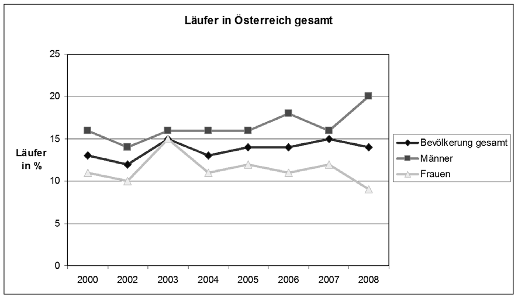

**Abbildung** **3:** **Läufer** **in** **Österreich** **gesamt**

Auf einer Beliebtheitsskala rangiert bei den Österreichern Radfahren auf
dem 1. Platz, Laufen auf dem 2. Platz und Nordic Walking auf dem 6.
Platz (Abb. 4).

> 19

Businessplan

**Abbildung** **4:** **Beliebteste** **Sportarten** **in**
**Österreich**

> **4.1.2.** **Deutschland**

In Deutschland gehen rund 26,5 Mio. Personen laufen, davon betreiben
rund 1,6 Mio. den Laufsport intensiv und regelmäßig. Weitere 3,2 Mio.
gehen zumindest regelmäßig laufen oder joggen. Darüber hinaus gibt es in
Deutschland 8,5 Millionen Nordic-Walker. Rund 3,6 Mio. der Deutschen
benutzen ihr Rad täglich. Den Radsport üben 14 Mio. (17%) der Deutschen
intensiv und regelmäßig, 25,6 Mio. (31%) gelegentlich und 19 Mio. (23%)
selten aus.

> **4.2.** **Branchenstruktur** **und** **Wettbewerber**

Das Unternehmen runtastic ist sowohl im Bereich von Sportportalen als
auch im direkten Anwendungsbereich für Sportapplikationen tätig. Diese
beiden Teile werden nachfolgend unterteilt.

> **4.2.1.** ***Sportportale*** ***mit*** ***dem*** ***Fokus***
> ***auf*** ***Laufsport***
>
> **Portal** **Information**
>
> www.runnersworld.com
>
> www.runnersfun.at

Großes Portal, Tipps, Events, Trainingspläne, KEIN Trainingstagebuch

Minimalistisches manuelles Trainingstagebuch, Streckenpläne, Tipps

> 20

Businessplan

> www.maxfun.cc
>
> www.mapmyrun.com
>
> www.jogmap.de
>
> www.runningcheckpoint.at
>
> www.just4sport.de
>
> www.loveyourlife.at
>
> www.connect.garmin.com
>
> www.runsport.at

Events, Magazin, Laufstrecken, manuelles Trainingstagebuch, Fotoalbum,
Gewinnspiele Trainingstagebuch mit Strecken (manuell, iPhone, Pulsuhren,
Nike+), kostenpflichtige Trainingspläne, Events, Forum, Shop

Manuelles Trainingstagebuch mit Strecken, Laufgruppen, Forum,
Lauftrainings-Podcast, Standardtrainingspläne Vorstellung einzelner
Laufstrecken mit Foldern in Streckenlokalen in den Städten

Gratis Trainingspläne zum Downloaden, manuelles Trainingstagebuch,
Streckenvermessung mit GPS, Blogs Allgemeines Fitnessportal mit vielen
Tipps, Berichten und Events zum Thema Ernährung & Fitness

Portal zur Verwaltung von Trainingsplänen, Streckendarstellung,
Laufauswertungen mit Garmin-Pulsuhren

E-Shop speziell für Sportbereich

> Automatisches Trainingstagebuch für Streckendarstellung
>
> fertige Trainingspläne für 5km, 10km, Marathon und Ironman, E-Shop

**Abbildung** **5:** **Übersicht** **der** **wichtigsten**
**Sportportale**

> iPhone mit

Halbmarathon,

> 21

Businessplan

> **4.2.2.** ***Sportapplikationen*** ***mit*** ***dem*** ***Fokus***
> ***auf*** ***Laufsport***

Neben den bekannten Anbietern von Sportarmbanduhren wird in letzter Zeit
das Mobiltelefon für den Laufsport immer interessanter. Dies liegt nicht
zuletzt an der fortschreitenden Technologie, welche es via GPS-Sensoren
möglich macht, einen gesamten Lauf zu tracken und anschließend im
Internet darzustellen.

Im Mobilfunkbereich wurde bereits 2007 eine Marktpenetration von über
100% erreicht. Auch die Verbreitung des Internetzugangs (70%) konnte in
den letzten Jahren eine kontinuierliche Steigerung verbuchen. Diese
Zahlen bestätigen, dass sich die Branche für Sportapplikationen durch
eine hohe Verbreitung von Mobiltelefonen und Internet hervorragend für
das geplante Vorhaben von runtastic eignet.

> **4.2.3.** ***Wettbewerber***

Die Hauptkonkurrenten für runtastic sind in mehreren Bereichen zu
finden. Im Sportportalbereich sind dies Portale wie runnersworld.com,
aber auch Communityportale wie Nike+.

Im Bereich der Sportapplikationen sind sowohl die drei großen Hersteller
von Sportarmbanduhren, Polar3, Garmin4 und Suunto5, als auch die
Mobiltelefonhersteller mit dazugehöriger Software große Konkurrenten.

Bei den Sportarmbanduhrherstellern wird runtastic eine Kompatibilität
mit dem Webportal herstellen, um die Benutzer dieser Uhren als Sportler
am Portal zu gewinnen.

Als problematischer wird die Konkurrenz am Mobilfunkmarkt empfunden, da
hier beispielsweise runkeeper6 mit seiner Anwendung am iPhone schon
stark am Markt vertreten ist, aber auch Nokia mit einer eigenen
Laufapplikation, dem Sportstracker, aktiv ist. Weitere Konkurrenten
werden im Anhang unter Auflistung der Stärken und Schwächen im Detail
dargestellt.

3 Vgl.:
[<u>http://www.polar-austria.at/at-de</u>](http://www.polar-austria.at/at-de)
4 Vgl.: [<u>http://www.garmin.at/</u>](http://www.garmin.at/)

5 Vgl.:
[<u>http://www.suunto.com/suunto/main/index.jsp?bmLocale=de_DE</u>](http://www.suunto.com/suunto/main/index.jsp?bmLocale=de_DE)
6 Vgl.: [<u>www.runkeeper.at</u>](http://www.runkeeper.at/)

> 22
>
>  style="width:1.32292in;height:0.29167in" />Businessplan
>
> **4.3.** **Zielmarkt**
>
> Aufgrund der Natur des Geschäftsmodells ergeben sich zwei Typen von
> Kunden, denen wir unterschiedliche Möglichkeiten bieten können:
>
> **4.3.1.** **USER:** **Kunden** **als** **Webplattform-Nutzer**
>
> Folgende Tabelle zeigt die primär angesprochenen Kundengruppen in
> diesem Segment, wobei auch Nichtsportler bei einer entsprechenden
> Bekanntheit von runtastic als USER infrage kommen könnten.

||
||
||
||
||
||
||
||

> **4.3.2.** **Kunden** **als** **Marketingpartner** **(Betreiber**
> **einer** **Laufstrecke,** **Werbung)**

||
||
||
||

> 23
>
>  style="width:1.32292in;height:0.29167in" />Businessplan

||
||
||
||
||

> Zusammengefasst sollte für alle sport- und gesundheitsaffinen Firmen,
> öffentliche Einrichtungen und Städte/Gemeinden runtastic als
> Marketingpartner infrage kommen.
>
> **4.3.3.** **Finanziell** **bedeutendste** **Kundengruppen**
>
> Die **großen** **Städte** sind die finanziell bedeutendste
> Kundengruppe in der Start-Up-Phase von runtastic. Wenn es gelingt
> Laufstrecken in den großen Städten (Wien, Linz, Graz) auszustatten,
> kann man ein hohe Anzahl von Sportlern ansprechen sowie durch
> gemeinsame Marketing- und Vertriebsaktivitäten eine große
> Aufmerksamkeit erreichen.
>
> Die zweite sehr bedeutende Kundengruppe sind die **Firmenkunden**, da
> diese erstens als Sponsoren von Strecken mit dem runtastic Messsystem
> in Städten und Gemeinden dienen sollen. Dies ermöglicht den Städten in
> Kooperationen mit Firmenpartnern eine Laufstrecke zu betreiben und
> verringert damit die Eintrittsbarriere. Zweitens erwarten wir uns
> Einnahmen aus Onlinewerbung am Webportal, welche von Firmenkunden
> erbracht werden. Drittens sollen die Firmenkunden die Mitarbeiter zum
> Sport bewegen und somit neue Nutzer an runtastic binden.
>
> **4.3.4.** **Positionierung** **gegenüber** **dem** **Wettbewerb**
>
> **Mit** **der** **Akquise** **von** **Städten** **und** **Gemeinden,**
> **in** **denen** **fixe** **Messstationen** **installiert**
> **werden,** **können** **wir** **eine** **strategische** **Festigung**
> **am** **Markt** **erreichen.** Sind wir mit einer lokalen Strecke
> präsent, können wir de facto kurzfristig nicht vom Markt verdrängt
> werden, da es sich dabei um eine mehrjährige Investition in eine
> Strecke handelt. Um unser strategisches Kapital, bestehend aus den
> Messstrecken, auszubauen, beteiligen wir die Städte und Gemeinden an
> den Einnahmen (RFID Chip Verkauf). Ein diesbezügliches
> Ertragsbeteiligungsmodell wurde ausgearbeitet.
>
> Um unseren bereits bestehenden Webportalnutzern neue Möglichkeiten zu
> bieten sowie neue Kundengruppen anzusprechen, erfolgt ein
> kontinuierlicher Aufbau verschiedenster mobiler
>
> 24
>
>  style="width:1.32292in;height:0.29167in" />Businessplan
>
> Anwendungen. Dies ermöglicht sowohl die Festigung der bereits
> erzielten Marktanteile als auch eine großflächige internationale
> Expansion, die auf einem gesunden Fundament im Heimmarkt Österreich
> basiert.
>
> **4.3.5.** **Marktanteil** **und** **-umsatz**
>
> Im Folgenden wird der Marktanteil des fixen Systems in Österreich
> dargestellt, sowie der Markt für mobile Endgeräte weltweit
> dargestellt. Den Abschluss dieses Kapitels bildet der generierte
> Umsatz aus den dargestellten Marktanteilen im wahrscheinlichsten Fall
> (= Basisszenario).
>
> **Marktanteil** **fixe** **Station**
>
> **Basis** **Gesamtmarkt:7**
>
> • 2,5 Mio. Läufer und Nordic Walker in Österreich

||
||
||
||

> **Marktanteil** **mobile** **Systeme8**
>
> **Basis** **verkaufte** **Stück** **weltweit** **(Status**
> **7/2009):** • iPhone: **30** **Mio.** **Stück**
>
> • GPS-fähige Nokia + Google Mobiltelefone: **69** **Mio.** **Stück**

||
||
||
||
||

> **Umsatzquellen**
>
> Für runtastic ergeben sich pro Produkt-/Dienstleistungskategorie
> mehrere Umsatzquellen (Abb. 6).
>
> 7 Quelle: Statistik Austria
>
> 8 Quellen:
> [<u>http://mobilezoo.biz/manufacturers.php,</u>](http://mobilezoo.biz/manufacturers.php)
> [<u>http://www.texasstartupblog.com/2009/01/01/android-in-2009/</u>](http://www.texasstartupblog.com/2009/01/01/android-in-2009/)
>
> 25
>
>  style="width:1.32292in;height:0.29167in" />Businessplan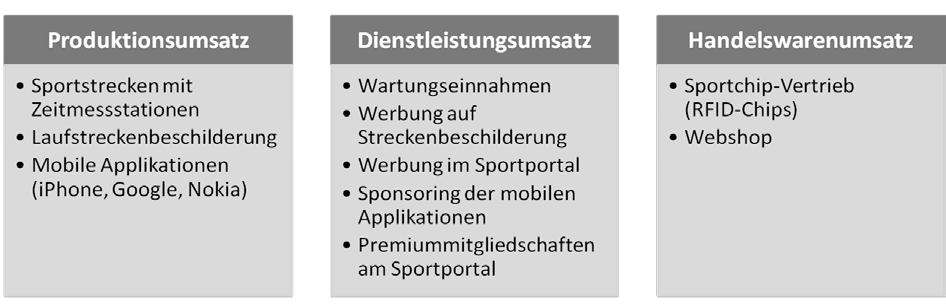 style="width:6.30556in;height:2.02778in" />
>
> **Abbildung** **6:** **Übersicht** **über** **die** **verschiedenen**
> **Umsatzquellen**
>
> Die oben angeführten Marktanteile führen zu folgenden Umsätzen in den
> nächsten Jahren:

||
||
||
||
||
||
||
||
||
||
||
||
||
||
||
||
||
||
||
||
||
||
||
||

> 26

Businessplan

**Abbildung** **7:** **Gesamtumsätze** **von** **runtastic**
**(2009-2014)**

Der Gesamtumsatz setzt sich prozentuell aus folgenden Komponenten
zusammen (Abb. 8):

> **Umsatzverteilung** **nach** **Bereichen** **in** **%**
>
> Laufstrecken-Beschilderung 6%
>
> Werbung
>
> 23%

Fixe Messstation

> 31%
>
> Webportal-Einnahmen
>
> 40%

Mobile Applikationen

> 0%

**Abbildung** **8:** **Umsatzzusammensetzung** **(kumuliert** **bis**
**2014)**

**Diese** **Umsätze** **bei** **gleichzeitig** **niedrigen**
**Marktanteilen** **zeigen** **das** **langfristige** **Potential**
**der** **runtastic** **Geschäftsidee.**

> 27
>
>  style="width:1.32292in;height:0.29167in" />Businessplan
>
> **4.4.** **Marketingstrategie**

||
||
||
||
||
||
||
||
||
||
||
||
||
||
||

> 28
>
>  style="width:1.32292in;height:0.29167in" />Businessplan

||
||
||
||
||
||
||
||
||
||

||
||
||
||
||
||
||
||

> 29
>
>  style="width:1.32292in;height:0.29167in" />Businessplan

||
||
||
||
||
||
||
||
||
||
||
||
||
||

> **Abbildung** **9:** **runtastic** **Marketingstrategie**
>
> 30

Businessplan

**5.** **Geschäftssystem** **und** **Organisation**

> **5.1.** **Geschäftssystem**

Runtastic widmet sich der Planung, Steuerung, Implementierung, Kontrolle
und kontinuierlichen Weiterentwicklung der eigenen Kernleistungen, dh
Möglichkeiten zur Erfassung, Verwaltung und zum Teilen von Sportdaten
bereitzustellen und zu generieren.

Folgende Funktionen werden dabei eigenständig oder gemeinsam mit
Kooperationspartnern (bei hohem Eigenanteil) durchgeführt:

> • Aufgaben der Geschäftsführung • Forschung und Entwicklung
>
> • Soft- und Hardwareentwicklung
>
> • Sicherstellen des laufenden Betriebes (Webportal, fixe
> Messstationen, Wartung) • Marketing
>
> • Vertrieb
>
> • Aufbau und Pflege eines Kooperationsnetzwerkes
>
> **5.2.** **Organigramm**
>
> 31

Businessplan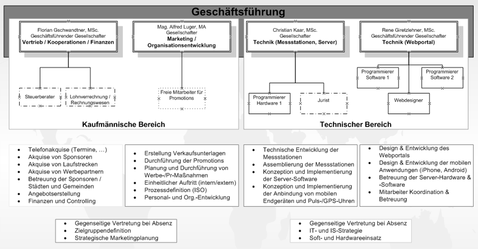

**Abbildung** **10:** **Organigramm** **runtastic**

> 32

Businessplan

> **5.3.** **Gelebte** **Werte**

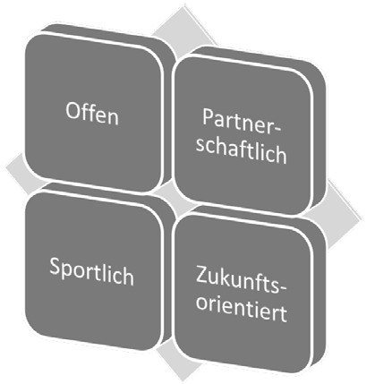**Offen** heißt für uns:

> • Sich vor keinen Möglichkeiten verschließen • Offene Kalkulation von
> Angeboten
>
> • Ehrlich miteinander im Team umgehen

**Partnerschaftlich** heißt für uns:

> •     Netzwerke aufbauen und pflegen •     Kunden und Mitarbeiter
> beteiligen

**Sportlich** heißt für uns:

> • Hohe Ziele anstreben und proaktiv verfolgen • Sport selbst betreiben
>
> • Den Kundennutzen im Fokus haben
>
> **Zukunftsorientiert** heißt für uns:
>
> • Neue Technologien einsetzen und anbinden
>
> • Konsequente Marktbeobachtung und Differenzierung durch Innovation •
> Think different!
>
> **5.4.** **Zugekaufte** **Leistungen**

Aufgrund fehlender Kompetenzen der Firmengründer sowie aus Gründen der
Fokussierung auf die Kernkompetenzen werden folgende Bereiche am Markt
zugekauft:

> • Buchhaltung und Jahresabschluss - Steuerberater •
> Personalverrechnung - Lohnverrechnungsbüro
>
> • Rechtsberatung und Rechtsbeistand - Anwaltskanzlei
>
> • Installation der fixen Messstationen – lokale Bauunternehmen der
> Gemeinden/Städte • Webshop: Zukauf vom Anbieter xt:commerce
>
> • Onlinezahlungsabwicklung: Zukauf von einem standardisierten Anbieter
> (Bezahlung erfolgt auf Provisionsbasis der getätigten Transaktionen)
>
> • Laufstreckenbeschilderung inkl. Steher von Bayer Schilder GmbH
>
> **5.5.** **Wesentliche** **Kooperationspartner**
>
> 33

Businessplan

> **5.5.1.** **Technische** **Entwicklung**

Mit der **Fachhochschule** **Hagenberg** wird die bereits bestehende
Kooperation im Bereich der technischen Entwicklung (Messstation, mobile
Entwicklung) weitergeführt. Drei der vier Gründer haben in Hagenberg
studiert und haben ein gutes Naheverhältnis zu den Akteuren der FH. Der
Hauptnutzen besteht für runtastic in der Nutzung von hochqualifizierten
Fachkräften. Für die FH Hagenberg liegt der Nutzen in einer praxisnahen
Forschung und einer Kooperation zur Wirtschaft. Zudem ergeben sich
positive Marketingeffekte für die FH.

Mit der **Fachhochschule** **Wels** wird eine Kooperation im Bereich der
Sicherstellung des Betriebes der fixen Messstationen mit Solarenergie
eingegangen. Der Nutzen für die FH Wels ist gleich wie der Nutzen der FH
Hagenberg.

> **5.5.2.** **Wirtschaftliche** **Entwicklung**

Runtastic strebt eine Kooperation mit den Betreibern der Lauf- bzw.
Sportstrecken an. Diese sollen als **Vertriebspartner** **der**
**RFID-Chips**, die notwendig für das Benützen der fixen Stationen sind,
dienen. Städte könnten beispielsweise in deren Bädern oder am
Gemeindeamt die Chips verkaufen. Runtastic bietet den Betreibern eine
Ertragsbeteiligung (2 € pro verkauftem RFID-Chip). Zusätzliche regionale
Vertriebspartner werden bei Bedarf nach erfolgreicher Installation einer
Strecke gesucht.

Runtastic geht **Kooperationen** **mit** **Anbietern** **(**sog.
**Affiliates)** **von** **Produkten** **im** **Sportbereich** (Kleidung,
Nahrung, Sportgeräte, …) ein, die ihre Produkte im runtastic Webshop
verkaufen wollen und diesbezügliche Provisionen an runtastic abtreten.
Die Leistungserbringung und der Versand sowie die Haftung obliegt den
Anbietern und nicht runtastic. Diesbezügliche Vorgespräche wurden
bereits geführt und es wurden bereits fünf Anbieter als
Kooperationspartner gewonnen (vorläufige mündliche Vereinbarung). Wir
bieten unseren Kooperationspartnern durch Beziehung von Provisionen
einen neuen Vertriebskanal sowie Zugang zu einer spezifischen, bereits
deklarierten Zielgruppe im Bereich Sport an.

Mittelfristig streben wir **Kooperationen** **mit** **Ärzten** **und**
**Akteuren** **im** **Gesundheitsbereich** an, um die Dienstleistungen
weiter ausbauen zu können (zB automatisierte Trainingspläne, zusätzliche
Statistiken, Gesundheitstipps, individuelle Bewertungen,
Ernährungspläne). Die Ärzte haben die Möglichkeit sich selbst zu
präsentieren und potentielle neue Kunden anzusprechen. Zudem können die
vollständig anonymisierten Daten von runtastic für Studienzwecke dienen.

Mittelfristig benötigt runtastic **Technologie-** **und**
**Marktpartner** **im** **Ausland**, um die fixen Messstationen für
Strecken zu betreiben. Ein Eigenbetrieb von Österreich aus ist nicht
zielführend. Ein diesbezüglicher Kooperationspartner wurde noch nicht
gesucht und gefunden. Alternativ wäre ein eigenes Vertriebsnetz denkbar.

> 34

Businessplan

Langfristig (ca. 24 Monate) werden wir die Schnittstellen (APIs) unseres
Webportals kontrolliert für **Programmierer** öffnen. Damit sollen neuen
Applikationen und Kundendienstleistungen entstehen. Auch hier ist eine
Ertragsbeteiligung für die Programmierer angedacht.

**6.** **Realisierungsfahrplan**

In diesem Kapitel wird der aktuelle Status der technischen Entwicklung,
der verfolgte Wachstumskurs und der konkrete Realisierungsplan für die
kommenden 18 Monate erläutert. Den Abschluss bilden Anmerkungen zum
kritischen Pfad sowie das geplante Vertriebskonzept.

> **6.1.** **Status** **der** **technischen** **Entwicklung**

Mit der bereits erhaltenen Förderung aus dem tech2b Business Inkubator
(90.000 €) wurde in den letzten 12 Monaten der in diesem Kapitel
beschriebene Status der technischen Entwicklung realisiert.

> **6.1.1.** **Zeitmessstationen**

Der Prototyp mit Stromanbindung vor Ort wurde bereits im Feld entlang
einer privat aufgebauten Sportstrecke erfolgreich getestet.

Ein erstes Pilotprojekt in der Stadt St. Valentin (Referenzsystem) steht
kurz vor der Genehmigung. Die Entscheidung wird bis Mitte September
gefällt.

> **6.1.2.** **Webportal**

Die Grundfunktionalität des Webportals wurde bereits erfolgreich
entwickelt. Bis zum Beta-Live-Launch des Portals Mitte Oktober 2009
erfolgen noch die grafische Aufbereitung der Inhalte (CSS) sowie
umfangreiche Tests, um Fehler erkennen und in weiterer Folge beheben zu
können.

> 35

Businessplan

> **6.1.3.** **Mobile** **Entwicklung**

Die erste mobile Applikation (runtastic iPhone Laufapplikation) wurde
bereits entwickelt und befindet sich aktuell im eigenen Testbetrieb.
Auch hier werden bis zum gemeinsamen Launch mit dem Webportal Mitte
Oktober die letzten Fehler behoben und die grafische Aufbereitung sowie
das eingebaute „Voice-Feedback“ (sprachliches Feedback zu
Geschwindigkeit und Kilometerfortschritt) umgesetzt.

> **6.2.** **Wachstumskurs**

||
||
||
||
||
||
||
||
||
||
||
||
||
||

||
||
||
||
||
||
||
||
||
||
||
||
||
||

Dem runtastic-Geschäftsmodell liegen die o.a. Entwicklungen der
Userzahlen sowie des Umsatzes zugrunde. Dieser Wachstumskurs entspricht
dem Basisszenario.

> 36

Businessplan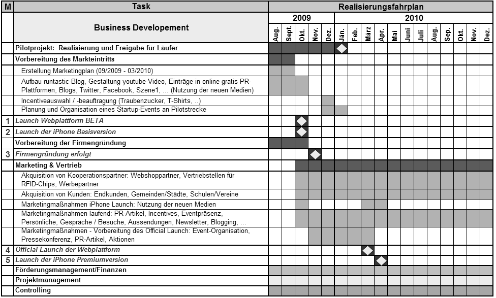

> **6.3.** **Realisierungsfahrplan** **2009-2010**
>
> **6.3.1.** **Wirtschaftliche** **Entwicklung**

**Abbildung** **11:** **Meilensteinplan** **wirtschaftlich**

> 37

Businessplan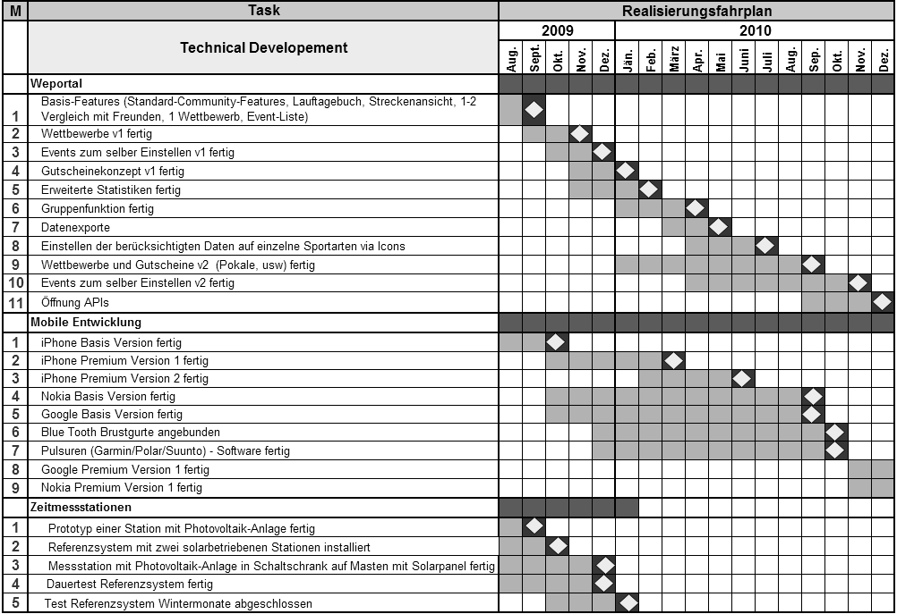

> **6.3.2.** **Technische** **Entwicklung**

**Abbildung** **12:** **Meilensteinplan** **technisch**

> **6.3.3.** **Kritischer** **Pfad**

Aufgrund des modularen Aufbaus des Webportals bzw. der unterschiedlichen
mobilen Entwicklungen, die jede für sich isoliert als Projekt bearbeitet
werden, gibt es kaum direkte Abhängigkeiten in der technischen
Entwicklung. Die Ausnahmen bilden die Versionierungen bei den mobilen
Endgeräten (zB iPhone Premium Version 1 und Version 2) als auch am
Webportal (zB Wettbewerbe V1 und V2). Die Entwicklung der Folgeversionen
kann erst begonnen werden, wenn die Basisversion entwickelt wurde.

Wichtige direkte Abhängigkeiten gibt es zwischen der technischen und
wirtschaftlichen Entwicklung. Das Erreichen des Meilensteins 1 der
technischen Entwicklung (Grundfunktionalität des Webportals) ist die
Voraussetzung für den BETA-Launch des Webportals (Meilenstein 1 der
wirtschaftlichen Entwicklung). Weiters hängen die Meilensteine der
Markteinführung der mobilen Lösungen (mobile Endgeräte) direkt mit der
technischen Entwicklung der mobilen Endgeräte ab.

> 38

Businessplan

Die kritischen Meilensteine sind erstens das Pilotprojekt und die
Freigabe für die Sportler (Jänner 2010). Ab diesem Zeitpunkt können
weitere Strecken installiert und für neue User geöffnet werden. Zweitens
ist der Official-Launch (offizieller Markteintritt im März 2010) ein
kritischer Meilenstein der Realisierung.

> **6.4.** **Eckpfeiler** **des** **Vertriebskonzepts**
>
> **6.4.1.** **Fixes** **System**

Für den Markteintritt und für das anfänglich wichtige Wachstum ist das
fixe System sehr wichtig. Runtastic bietet hier den Gemeinden und
Städten ein partnerschaftliches Modell, um die Finanzierung dieser
festen Messstationen zu ermöglichen. So besteht das fixe System aus den
Messstationen, Werbetafeln und den RFID Chips.

Runtastic wird den RFID Chip Verkauf in die Verantwortung der
Stadt/Gemeinde legen, um somit selber einen geringen Vertriebsaufwand zu
haben. Als Partner lässt runtastic hier die Stadt/Gemeinde 2 €/Chip
verdienen. Somit soll erreicht werden, dass die Städte/Gemeinden viel
Kraft in den RFID Chip Verkauf legen, um so die Kosten für die
Sportstrecke zu reduzieren. Runtastic schafft somit einen zusätzlichen
„Werbekanal“ wenn die Chips an verschiedenen Bereichen in der
Stadt/Gemeinde aufliegen (zB Freibad, Gemeindeamt, Sporthauptschule,
...). Da auf dem RFID Chip auch eine Werbefläche zur Verfügung steht,
bietet runtastic hier die Möglichkeit, diese mit Logos zu versehen. So
können auch Unternehmen der Stadt/Gemeinde sich aktiv an der
Finanzierung von Chips beteiligen und ihren Beitrag zum Sport leisten
und gleichzeitig auch Werbung betreiben.

Für die Finanzierung der fixen Zeitmessstationen strebt runtastic ein
PPP-Modell (Privat Public Partnership) gemeinsam mit Banken an, sollte
sich herausstellen, dass die Gemeinden/Städte nicht in der Lage sind,
die Sportstrecken zu finanzieren. Dies bietet den Kommunen den Vorteil,
die Sportstrecke nicht einmalig vorfinanzieren zu müssen, sondern
jährlich anmieten zu können.

Um auch kleinen Gemeinden die Möglichkeit zu geben, ihre Strecken
entsprechend auszustatten, bietet runtastic auch die Möglichkeit „nur“
die Beschilderung durchzuführen. So wird der Gemeinde eine
kostengünstige Form einer Sportstrecke geboten. Um neben der
Beschilderung auch Informationen über die Strecke anzubieten, wird diese
im runtastic Portal abgebildet (GPS-Vermessung der Strecke,
Bodenbeschaffenheit, km Angaben, ...).

**Vorgehen:** Da für runtastic eine kritische Masse an Benutzern am
Webportal wichtig ist, werden anfänglich vor allem die hoch
frequentierten Laufstrecken, welche sich meist in größeren Städten (zB
Wien, Linz, ...) befinden in Angriff genommen. Zusätzlich ist hier der
Vorteil gegeben, dass diese

> 39

Businessplan

Städte ein höheres Budget für den Sport- und Gesundheitsbereich
aufbringen können und somit die Finanzierung einfacher ist. Parallel
werden aber auch kleinere Städte und Gemeinden akquiriert um auch eine
Resonanz dieser zu bekommen.

> **6.4.2.** **Mobile** **Applikationen**

Der Vertrieb der mobilen Sparte von runtastic ist durch die „neuen“
Shopmodelle von Apple, Google und Nokia relativ einfach. Die von
runtastic entwickelte Applikation wird zum Beispiel an Apple gesendet.
Diese bieten die Software nach erfolgreicher Validierung dann weltweit
über ihr Shopsystem (im Fall Apple über den App-Store) an. Für die
sogenannten PRO Applikationen kann von runtastic selbst der Preis für
die Software bestimmt werden. Im Fall von Apple werden dann 70 % der
Verkaufserlöse an die Entwickler ausgegeben und 30 % bleiben bei Apple
für den „Vertrieb“. Ähnlich funktionieren auch die Shop-Modelle von
Google Android und Nokia.

Um zusätzliche Kooperationspartner für die mobilen Applikationen zu
gewinnen, versucht runtastic auch Werbepartner in diesem Bereich zu
akquirieren. Zum Beispiel wird der Splashscreen der mobilen Anwendung
mit einem zusätzlichen Logo (zB Intersport) versehen. Auch hier strebt
runtastic einen partnerschaftlichen Weg an. So wäre es durchaus denkbar,
für die Platzierung von Werbung in der mobilen Applikation im Gegenzug
runtastic-Werbefolder in den Sportgeschäften des Partners bei der Kassa
aufzulegen. Da die mobilen Applikationen weltweit angeboten werden, ist
es für runtastic wichtig, verschiedene Partner in verschiedenen
geografischen Regionen zu akquirieren.

**Vorgehen:** Mit Ende 2009 wird die erste mobile Applikation im
App-Store verfügbar sein. Diese wird in Form einer „Lite“ Version
kostenlos zur Verfügung gestellt. Erst Mitte 2010 wird danach die erste
kostenpflichtige Applikation von runtastic für den Preis von 0,99 €
angeboten. In der Zwischenzeit werden die Applikationen natürlich immer
wieder mit Erweiterungen und Bugfixes aktualisiert.

> **6.4.3.** **Werbepartnerschaften**

Da auch Werbung einen wichtigen Beitrag zur Finanzierung einer
Sportstrecke beiträgt, bietet runtastic auch hier ein
partnerschaftliches Modell an. Gemeinsam mit dem Kunden (Stadt/Gemeinde)
werden die Werbeeinnahmen auf der Strecke 50:50 geteilt. Somit zeigt
sich runtastic als offener und ehrlicher Partner und die Suche nach
potentiellen Sponsoren wird mit Hilfe des Kunden vereinfacht.

**Das** **von** **Partnerschaft** **geprägte** **Vertriebsmodell**
**von** **runtastic** **beinhaltet** **die** **aktuell** **sehr**
**bedeutenden** **Werte** **der** **Fairness** **und** **Kooperation.**
**Runtastic** **transferiert** **somit** **das** **weltweit** **sehr**
**erfolgreiche** **Kooperationsmodell** **im** **Onlinegeschäft**
**auf** **sämtliche**

> 40

Businessplan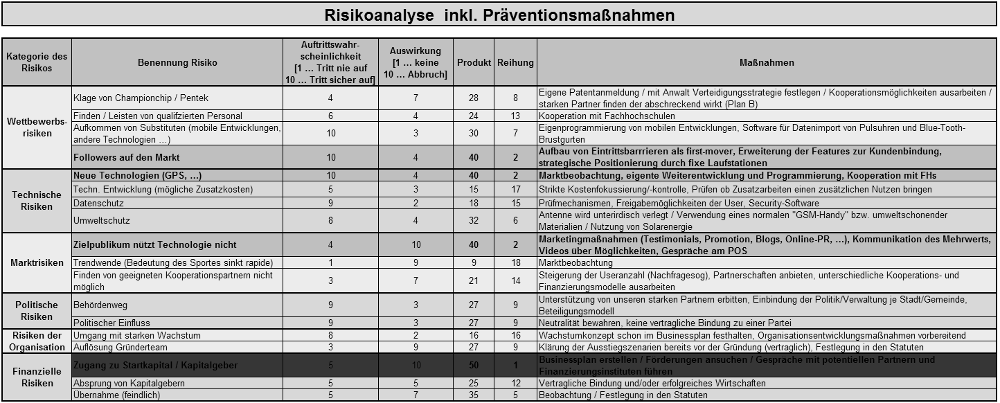

**Geschäftsbeziehungen.** **Davon** **kann** **runtastic**
**nachhaltig** **gemeinsam** **mit** **den** **Partnern**
**profitieren.**

**7.** **Risiken**

Die folgende Abb. 13 zeigt die Risiken, mit denen runtastic umzugehen
hat und beinhaltet die zentralen Präventionsmaßnahmen. Damit können die
Risiken entweder vermindert oder sogar vermieden werden. Die farblich
hervorgehobenen Bereiche zeigen die wichtigsten Risiken. Das größte
Risiko am Scheitern des runtastic Business Case sind fehlende bzw.
unzureichende Finanzierungsquellen, um die technische und kaufmännische
Entwicklung weiterzuführen.

**Abbildung** **13:** **Risikoanalyse** **runtastic**

> 41

Businessplan

**8.** **Finanzierung**

> **8.1.** **Zentrale** **Annahmen**

Folgende Annahmen bestimmen den Finanzplan:

> • Förderungen/Zuschüsse sind nicht in den Berechnungen enthalten
>
> • Keine Gewinnausschüttung bzw. Bonifikationen an die
> Unternehmensgründer • Zahlungsziele (Kunden und Lieferanten): 30 Tage
>
> • 20 % Anzahlung der Betreiber bei den Strecken mit fixen
> Zeitmessstationen • Gehalt für die vier Gründer: laut Kollektivvertrag
>
> Annahmen zu den Komponenten des Ertragsmodells *(Details* *siehe*
> *Anhang* *B)*: • Fixe Zeitmessstationen: Erlös 9.500 € pro Strecke
>
> • RFID Chips: Erlös 15 € (Einkauf 4 € + 1 € im Ø an Partner) pro Stück
>
> • Mobile Applikationen (Pro Version): 0,99 € pro Download (unser
> Umsatzanteil 0,69 €) • Premiummitgliedschaft: 40 € pro Jahr und User
> (12 % der User nehmen Angebot an) • Webshop: 30 € Ø Bestellung, Marge
> Ø 15 %, 12 % der User kaufen pro Quartal
>
> **8.2.** **Break-Even-Point**

Der Break-Even-Point wird im dritten Geschäftsjahr (2012) erreicht (Abb.
14)

> 42

Businessplan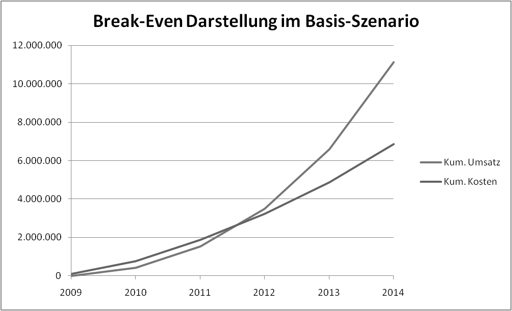

**Abbildung** **14:** **Break-Even-Point** **im** **Basisszenario**

> 43

Businessplan

> **8.3.** **Kapitalbedarf** **bis** **zum** **Break-Even-Point**

Der Kapitalbedarf bis zur Erreichung des Break-Even-Point liegt im
höchsten Fall bei ca. **350.000** **€** (siehe Berechnung Finanzplan im
folgenden Kapitel).

**Wie** **möchte** **runtastic** **diesen** **Finanzbedarf**
**lukrieren?**

Um den Finanzbedarf zu decken ist folgender Finanzierungsmix geplant:

> • <u>Kapitalbedarf - 350.000 €</u>
>
> • Eigenkapital durch die Gesellschafter
>
> • Beteiligung im Rahmen der UBG-Gründerfonds-Förderung

\+ 40.000 €

\+ 75.000 €

> • <u>Darlehen im Rahmen der UBG-Gründerfonds-Förderung + 75.000 €</u>
>
> **Finanzielle Lücke - 160.000 €**

Mit einem strategischen Investor („Business Angel“) wird die Lücke von
160.000 € geschlossen werden. Weiters nimmt runtastic an Wettbewerben
(i2B, enable2start, seedcamp) teil, um zusätzliche Finanzmittel
lukrieren zu können.

Zudem ist das Ansuchen um eine Förderung der weiteren innovativen,
technischen Entwicklung in Form eines FFG-Basisantrags in Arbeit. Dies
soll die zukünftige, technische Entwicklung absichern und zudem die
Liquidität erhöhen.

Kurzfristige Liquiditätsschwankungen (spätere Zahlungen der Kunden,
Projektvorfinanzierung, …) werden mit einem Kontokorrentkredit
abgedeckt.

> **8.4.** **Aufwände**

Beginnend mit der Aufstellung über die Aufwände in diesem Abschnitt
werden die einzelnen Teile des Finanzplans in den nächsten Abschnitten
jeweils für vier Jahre (2010 bis 2013) dargestellt Die Aufwände und
Erträge aus dem Jahr 2009 sind im Jänner 2010 eingerechnet. Diese
Restriktion ergab sich aus der verwendeten Businessplansoftware
Plan4You, mit der nur maximal 4 Jahre geplant werden können. Die Zahlen
beziehen sich jeweils auf das Basisszenario.

**Personalaufwand:**

> 44

Businessplan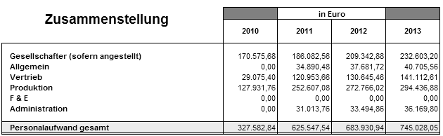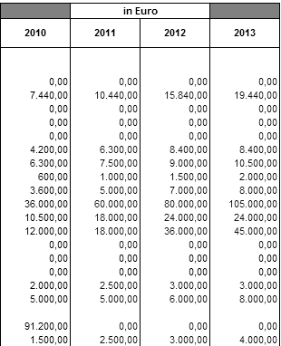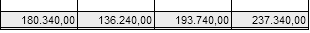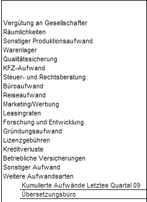

**Abbildung** **15:** **Personalaufwand** **runtastic**

**Sonstiger** **Aufwand:**

**Abbildung** **16:** **Sonstige** **Aufwände** **runtastic**

In den F&E-Aufwänden sind drei Mitarbeiter auf Werkvertragsbasis
enthalten, die zusammen ungefähr ein 1 Vollzeitäquivalent eines
festangestellten Mitarbeiters ergeben.

> 45

Businessplan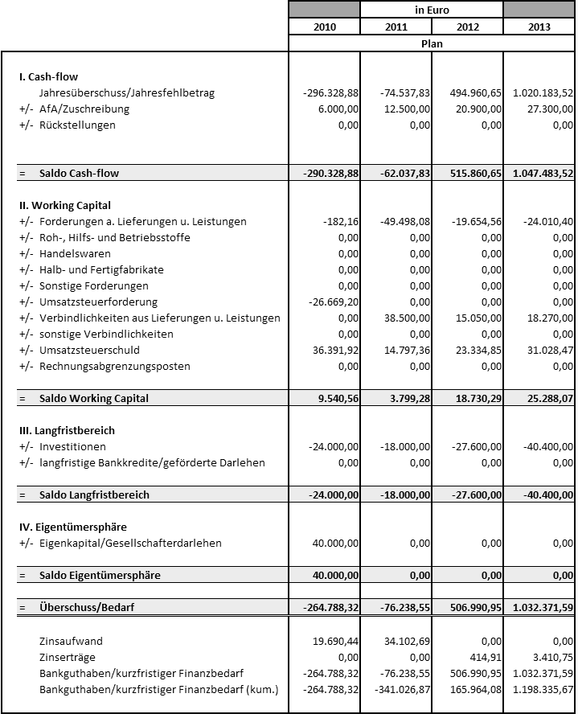

> **8.5.** **Finanzplan**

**Abbildung** **17:** **Finanzplan** **runtastic**

> 46

Businessplan

> 47

Businessplan

> 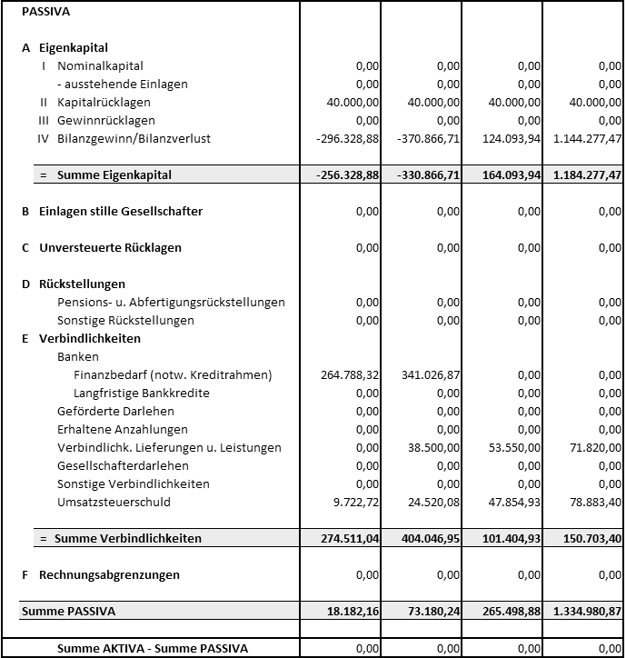 style="width:4.73611in;height:4.97639in" />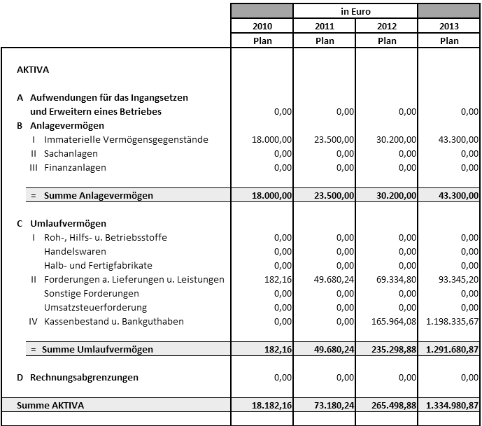 style="width:4.73611in;height:4.1875in" />**8.6.** **Plan-Bilanz**

**Abbildung** **18:** **Plan-Bilanz** **runtastic**

> 48

Businessplan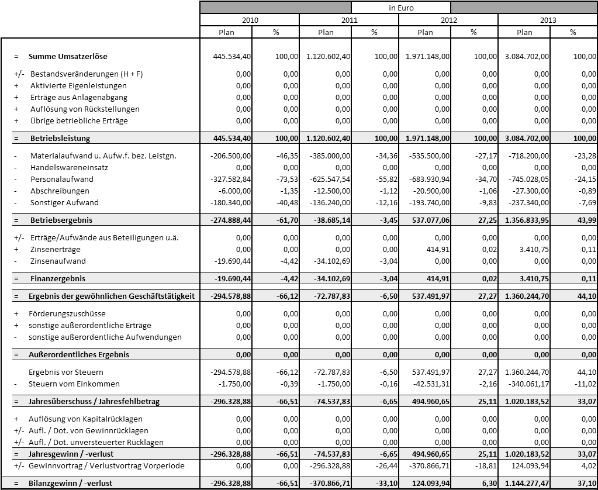

> **8.7.** **Plan-GUV**

**Abbildung** **19:** **Gewinn-** **und** **Verlustrechnung**
**runtastic**

> **8.8.** **Kennzahlen**
>
> 49

Businessplan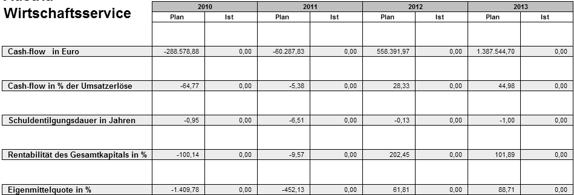

**Abbildung** **20:** **Kennzahlen** **runtastic**

> **8.9.** **Worst-Case-Szenario**

Das Worst-Case-Szenario beinhaltet folgende Annahmen im Vergleich zum
Basis-Szenario: • 35 % weniger Sportstrecken mit Zeitmessstationen
(2010-2014)

> • 43 % weniger mobiler Nutzer (2010-2014)
>
> • Niedrigere Käuferrate (Webshop, Premium-Accounts, Laufstrecken mit
> Beschilderungen) und weniger mobile User, die das Webportal benutzen
>
> • Dies Aspekte führen zu:
>
> o 60 % weniger Webportaleinnahmen (2010-2014) o 60 % weniger
> Werbeeinnahmen (2010-2014)
>
> o 45 % weniger Gesamtumsätzen (2010-2014)
>
> • Um 20 % reduzierte Ausgaben ab 2011 (Sparmaßnahmen durch mäßige
> Entwicklung)
>
> **Abgeleiteter** **Break-Even-Point** **im** **Worst-Case-Szenario:**
>
> Der Break-Even-Point wird im fünften Jahr (2014) erreicht. Der
> Cash-Flow ist ab dem vierten Jahr (2013) positiv (Abb. 21).
>
> 50

Businessplan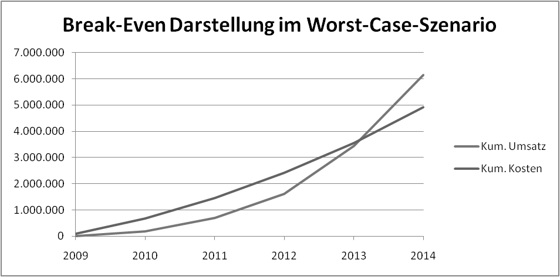

**Abbildung** **21:** **Break-Even-Point** **im**
**Worst-Case-Szenario**

**Abgeleiteter** **Finanzbedarf** **im** **Worst-Case-Szenario:**

Im Worst-Case-Szenario liegt der Kapitalbedarf bei 800.000 €. Dieser
Kapitalbedarf entsteht wenn frühzeitig keine Anpassungen bei den
geplanten Kosten getätigt werden.

**Maßnahmen** **beim** **Eintritt** **des** **Worst-Case-Szenarios:**

> • Suche nach weiteren strategischen Investoren (Business Angels,
> Venture Capitalist) • Entlassung von Mitarbeitern und
> Kostensenkungsmaßnahmen
>
> • Prüfung alternativer Förderungen
>
> • Prüfung eines umfangreichen Bankdarlehens
>
> • Erhöhte und evt. teurere Marketingmaßnahmen (Werbung, um Nutzerzahl
> zu erhöhen)
>
> 51

Businessplan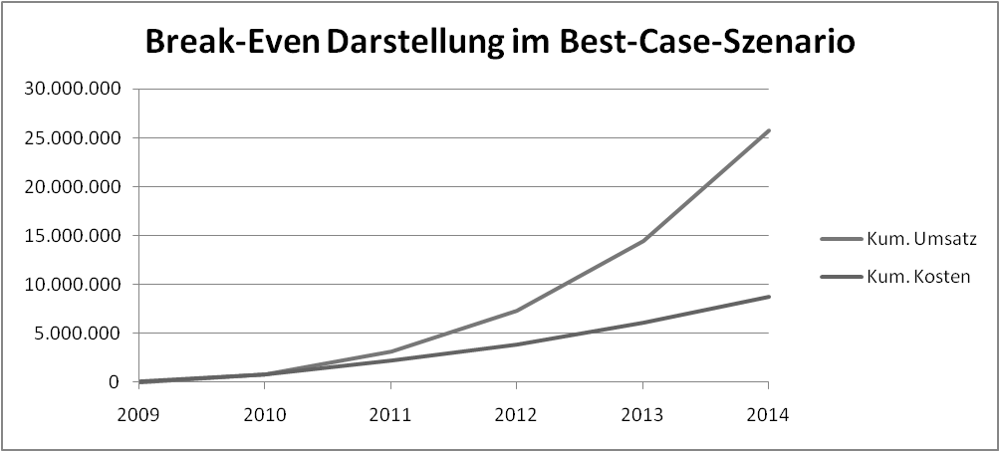

> **8.10.** **Best-Case-Szenario**

Das Best-Case-Szenario beinhaltet folgende Annahmen im Vergleich zum
Basis-Szenario: • 97 % mehr Sportstrecken mit Zeitmessstationen
(2010-2014)

> • 110 % mehr mobile Nutzer (2010-2014)
>
> • Höhere Käuferrate (Webshop, Premium-Accounts, Laufstrecken mit
> Beschilderungen) und mehr mobile User, die das Webportal benützen
>
> • Dies Aspekte führen zu:
>
> o 210 % höheren Webportaleinnahmen (2010-2014) o 55 % höheren
> Werbeeinnahmen (2010-2014)
>
> o 131 % höheren Gesamtumsätzen (2010-2014)
>
> • 15 % höhere Kosten im Jahr 2010 sowie 30 % erhöhte Kosten in den
> Folgejahren (erhöhte Anzahl an Mitarbeitern, um Boom-Phase optimal
> nützen zu können)
>
> **Abgeleiteter** **Break-Even-Point** **im** **Best-Case-Szenario:**
>
> Der Break-Even-Point wird im ersten Jahr (2010) erreicht (Abb. 22).

**Abbildung** **22:** **Break-Even-Point** **im** **Best-Case-Szenario**

**Abgeleiteter** **Finanzbedarf** **im** **Best-Case-Szenario:**

Im Best-Case-Szenario liegt der Kapitalbedarf bei knapp unter 100.000 €.
Bereits lukrierte Mittel aus Förderungen bzw. durch Investoren können
für ein noch rascheres Wachstum investiert werden oder als strategische
Reserve dienen.

**Maßnahmen** **beim** **Eintritt** **des** **Best-Case-Szenarios:**

> 52

Businessplan

> • Internationale Expansion wird stark forciert und das Portal auf
> zusätzliche Sprachen erweitert
>
> • Übernahme von kleineren Konkurrenten und/oder komplementären
> Unternehmen (Ergänzung des Produkt-/Dienstleistungsportfolios)
>
> 53
>
>  style="width:1.32292in;height:0.29167in" />Businessplan
>
> **Anhang:** **Übersicht** **über** **die** **Wettbewerber** **im**
> **mobilen** **Bereich**

||
||
||
||
||
||
||
||

> 9 Vgl.: <http://nike.com/nikerunning/>
>
> 10 Vgl.: <http://www.mapmyfitness.com/> 11 Vgl.:
> <http://www.gpsies.com/>
>
> 12 Vgl.: <http://www.runnerplus.com/>
>
> 13 Vgl.: Members, <http://www.runnerplus.com/members/>
>
> 54
>
>  style="width:1.32292in;height:0.29167in" />Businessplan

||
||
||
||
||
||
||

> 14 Vgl.: <http://www.runkeeper.com/> 15 Vgl.:
> [http://www.trailguru.com](http://www.trailguru.com/)
>
> 16 Vgl.: <http://pathtracks.com/> 17 Vgl.:
> [http://gps.motionx.com](http://gps.motionx.com/)
>
> 18 Vgl.: <http://sportstracker.nokia.com/>
>
> 19 Vgl.:
> <http://www.manager-magazin.de/it/artikel/0,2828,594503,00.html>
>
> 20 Vgl.:
> <http://de.statista.com/statistik/daten/studie/6122/umfrage/im-ersten-quratal-2009-weltweit-verkaufte-handys/>
>
> 55
